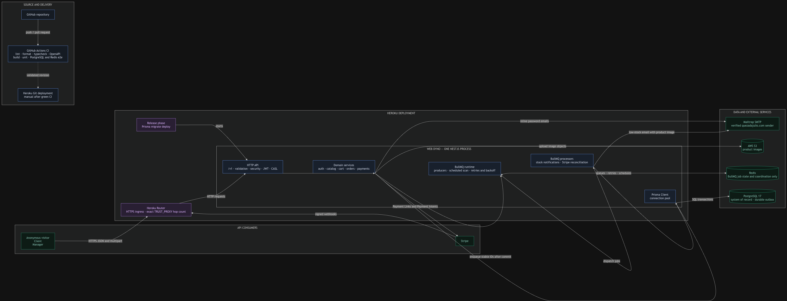

# T-Shirt Store API

A NestJS API for a T-shirt store. It implements all 28 operations in
[`api/openapi.yaml`](api/openapi.yaml), including authentication, catalog,
carts, orders, Stripe payments, signed webhooks, and low-stock email jobs.

[Open the contract in Swagger Editor](https://editor.swagger.io/?url=https%3A%2F%2Fraw.githubusercontent.com%2FAlejandroq12%2Ftshirt-store-api%2Fdev%2Fapi%2Fopenapi.yaml).

## Scope

The API has three user modes:

| Caller    | Main actions                                                               |
| --------- | -------------------------------------------------------------------------- |
| Anonymous | Read active products and visible SKUs                                      |
| Client    | Manage likes, their cart, their orders, order history, and Payment Intents |
| Manager   | Manage products, SKUs, images, all orders, and Payment Links               |

Main features:

- Access and refresh JWTs backed by revocable database sessions
- Argon2id passwords and password reset by email
- Product lifecycle, variants, S3 images, likes, and current-price carts
- Order snapshots, history, and status tracking
- Stripe Payment Intents, Payment Links, and signed webhooks
- Ordered stock locks and BullMQ email jobs with scheduled recovery
- Strict validation, Problem Details errors, CASL permissions, and safe logs

The API does not include category management, manager sign-up, `GET /skus`,
refunds, `/health`, `/docs`, or admin pages. The seed creates categories and the
first manager. Product details include their SKUs.

## Stack

- Node.js 22+, TypeScript, NestJS 11, OpenAPI 3.1, Redocly, and oasdiff
- PostgreSQL with Prisma 6; JWT sessions, Argon2id, and CASL
- Stripe, AWS S3, Nodemailer, BullMQ, and Redis
- Jest, Supertest, GitHub Actions, and Heroku

## Architecture



The app is a modular monolith. One NestJS process contains the HTTP API,
domain services, Prisma Client, BullMQ producers, and BullMQ processors.
PostgreSQL, Redis, Stripe, S3, and SMTP are external services.

BullMQ is code inside NestJS. Redis stores its jobs, retries, and schedules.
Redis does not store orders, stock, or users. PostgreSQL is the source of truth
and also stores pending webhook events and email work.

The current Heroku app has no separate worker process. Each web dyno handles
HTTP and background jobs. This is simple for the current size. A separate
worker entry point would allow independent scaling later.

See [`docs/architecture.md`](docs/architecture.md) for the Mermaid source,
queue choice, deployment shape, and monitoring plan.

## Project structure

```text
api/openapi.yaml       HTTP contract
docs/                  architecture, data lifecycle, and database design
prisma/                schema, migrations, constraints, and seed
src/main.ts            only process entry point
src/bootstrap.ts       shared HTTP setup
src/app.module.ts      module composition
src/auth/              login, JWTs, sessions, and password flows
src/products/          product reads and manager writes
src/skus/              product variants
src/images/            S3 image upload and assignments
src/cart/              client cart
src/orders/            snapshots, history, and status changes
src/payments/          Stripe links, intents, and webhooks
src/notifications/     stock cycles, BullMQ jobs, and reconciliation
src/authorization/     CASL permissions
src/common/            validation and Problem Details errors
src/config,logging/    validated configuration and safe logs
src/prisma,mail,storage/ database, SMTP, and S3 adapters
test/                   end-to-end tests and fixtures
```

Controllers handle HTTP. DTOs validate input. Services hold business rules and
transactions. Guards handle authentication and permissions. Feature modules
register their CASL rules. Services use Prisma directly, so there is no extra
repository layer that only repeats Prisma calls.

## Request flow

For `POST /v1/orders`, the path is: Heroku Router, NestJS request setup, JWT
and session guard, CASL guard, controller, `OrdersService`, Prisma transaction,
PostgreSQL constraints, then the HTTP response.

[`src/bootstrap.ts`](src/bootstrap.ts) adds `/v1`, Helmet, CORS, proxy trust,
strict 422 validation, and the global error filter. E2E tests use this same
setup.

## Security and background work

Authentication uses access and refresh JWTs plus a `sessions` row. Logout
revokes one session. Password change or reset revokes all sessions for that
user. Every route needs JWT by default unless it uses `@Public()` or
`@OptionalAuth()`.

Pino logs JSON in deployed environments. It returns an `X-Request-Id` and hides
authorization headers, cookies, passwords, tokens, Stripe signatures,
`clientSecret`, card fields, and known environment secrets. Server errors do
not return internal detail.

The Stripe webhook verifies `Stripe-Signature` against the raw request body.
It stores the event before business changes. A repeated event ID does not apply
stock twice.

Successful payment locks Products first and SKUs in ascending ID order. Order,
stock, cart reconciliation, low-stock outbox, and webhook state commit in one
transaction.

Low stock means total Product stock crosses from above 3 to 3 or less. The
worker emails clients who liked the Product and have not kept a paid purchase
of it. The email includes a Product image. BullMQ retries five times with
exponential backoff. A scan runs every 30 seconds to recover pending work.

## Production & Reliability

- **Horizontal scaling:** 2 Heroku Standard-1X web dynos.
- **Safer deployments:** Heroku Preboot enabled.
- **Migration safety:** Prisma migrations run in Heroku Release Phase before deployment.
- **Staging environment:** Dedicated Heroku staging app with isolated PostgreSQL.
- **Disaster recovery tested:** Production backup successfully restored and verified in staging.
- **Deployment pipeline:** GitHub -> CI -> Staging -> manual promotion -> Production.
- **Operational monitoring:** Heroku metrics for latency, errors, memory, throughput, and dyno load.
- **Shared infrastructure:** PostgreSQL as durable state and Redis/BullMQ for background processing.

The CI workflow verifies code but does not contain the Heroku deployment step.
Staging deployment and manual promotion are configured outside that workflow.
Both web dynos also run BullMQ processors, so scaling web adds database and
Redis connections as well as HTTP capacity.

The Heroku process types are:

```procfile
release: npx prisma migrate deploy
web: node dist/main.js
```

Production is at <https://t-shirt-api-2e742ec1e3f1.herokuapp.com/v1>. There is
no `/` route. Use `/products?limit=20&offset=0` to check it. Production email
uses Mailtrap with the verified `quezadajulio.com` domain.

## Local setup

Requirements: Node.js 22 or newer and Docker with Compose.

For a first setup only:

```bash
cp .env.example .env
cp .env.test.example .env.test
cp .env.seed.example .env.seed
```

Review the copied values, then run:

```bash
npm ci
docker compose up -d
npm run db:migrate
npm run db:seed
npm run start:dev
```

The API is at `http://localhost:3000/v1`. Mailpit is at
`http://localhost:8025`. Stop services with `docker compose down`.

The seed creates inactive Products because activation needs a primary fallback
image. Log in as the seeded manager, upload an image, then PATCH the Product to
`active` before testing it as an anonymous user or client.

If the host PostgreSQL port changes, update `POSTGRES_PORT` and the port inside
both `DATABASE_URL` values. Never point `.env.test` at a non-test database.

Real Stripe test keys are needed for payment calls. Configure Stripe to send
`payment_intent.succeeded` and `checkout.session.completed` to
`/v1/webhooks/stripe`. The Stripe CLI can forward local events and provide its
signing secret. Real S3 configuration is needed only for image upload.

If npm ignores install scripts, run `npm run db:generate`; run `npx husky` to
install the optional Git hook.

## Environment variables

Use `.env.example` for the API, `.env.test.example` for E2E, and
`.env.seed.example` for the seed manager.

Main groups are `DATABASE_URL`, `REDIS_URL`, JWT secrets and TTLs, password
settings, `STORE_CURRENCY`, SMTP, Stripe, S3, CORS, and `TRUST_PROXY`.
Configuration is validated at startup. In production, published placeholder
secrets are rejected.

AWS credentials are optional because the AWS SDK uses its default provider
chain. `AWS_ACCESS_KEY_ID`, `AWS_SECRET_ACCESS_KEY`, and `AWS_SESSION_TOKEN`
are one supported source. Validation checks value shape, not provider access.

## Database and seed

Prisma creates 16 models and 21 foreign keys. SQL migrations add 18 CHECK
constraints, 8 partial indexes, and one trigger that blocks hard deletion of
Products. Key rules include non-negative stock, correct line totals, one pending
order per client, and one low-stock email per client, Product, and cycle.

Commands:

```bash
npm run db:migrate         # create or apply a development migration
npm run db:migrate:deploy  # apply committed migrations
npm run db:migrate:test    # apply migrations using .env.test
npm run db:seed            # manager, 10 categories, 15 Products, 38 SKUs
npm run db:studio          # inspect local data
```

Do not edit an applied migration. Add a new one and keep `schema.prisma`, SQL,
DBML, and lifecycle docs aligned. Prisma manages a connection pool per process.
This repo does not set a fixed pool size. The seed is safe to rerun and its
manager password is loaded only by the seed process.

## Tests

Start PostgreSQL and Redis before E2E tests:

```bash
docker compose up -d postgres redis
npm run lint
npm run format:check
npm run typecheck
npm run lint:api
npm run build
npm run test:ci -- --runInBand
npm run test:e2e
```

`test:e2e` applies test migrations first. `truncateAll` refuses to clear a
database whose name does not end in `_test`.

E2E uses real NestJS, PostgreSQL, Redis, and BullMQ. Stripe, S3, and SMTP use
controlled fakes. Checkout tests also enqueue a real reconciliation job and
wait for the registered worker without calling it directly.

GitHub Actions runs the same checks with PostgreSQL 17 and Redis 8. Pull
requests also run oasdiff to reject breaking OpenAPI changes. No Postman
collection is committed. Import `api/openapi.yaml` into Postman or use Swagger
Editor.

## Main design choices

- OpenAPI defines routes, schemas, and status codes.
- A modular monolith keeps deployment and transactions simple.
- PostgreSQL constraints and locks protect important rules.
- Carts do not reserve stock. Payment checks it again under locks.
- Orders freeze purchase data. Pending jobs are stored before processing.
- BullMQ processors share web dynos for the current deployment.
- Money stays as decimal strings; invalid input returns Problem Details with 422.

## Known limits

- Cancelling an Order does not cancel or refund its Stripe Payment Intent. A
  late payment needs manual reconciliation.
- Permanent webhook errors have no dead-letter or manual-review state.
- A Stripe Payment Link can remain active if its local insert fails.
- Webhooks do not verify the paid amount and currency against the frozen Order.
- Money conversion supports only currencies with two decimal places.
- Payment Link buyers are matched to a CLIENT by checkout email.
- Stock email delivery is at least once, so a crash can cause a duplicate.
- Heroku Redis TLS is encrypted but does not verify the certificate chain.
- Password-reset rate limits are stored per web dyno, not shared.
- Page size has no maximum because the current contract defines none.
- File upload checks declared MIME and size, not file magic bytes or malware.
- There is no app health endpoint, trace system, or alerting integration.
- `npm audit` is not clean. On 2026-09-09 it reported 11 high dependency
  nodes, or 9 with dev dependencies omitted. Recheck and upgrade safely before
  release. Do not apply suggested major downgrades without testing.

## Agent foundation

The AI-assisted workflow is versioned in [`CLAUDE.md`](CLAUDE.md),
[`.claude/`](.claude), [`mcp/`](mcp), and
[`docs/agentic-workflow.md`](docs/agentic-workflow.md).

Hooks block agents from reading real environment files or writing Git history.
The repository owner reviews the diff, runs checks, and authors commits.

See also [`docs/architecture.md`](docs/architecture.md),
[`docs/data-lifecycle.md`](docs/data-lifecycle.md),
[`docs/implementation-notes.md`](docs/implementation-notes.md), and
[`docs/db.dbml`](docs/db.dbml).
