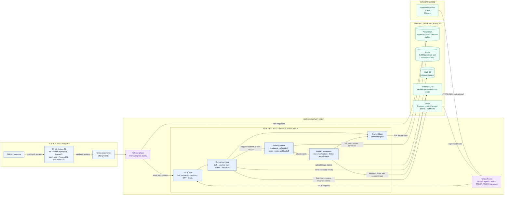

# T-Shirt Store API architecture

This is the production shape implemented by the repository. The HTTP surface is
defined by [openapi.yaml](../api/openapi.yaml); detailed state rules live in
[data-lifecycle.md](data-lifecycle.md).

## Production diagram

## Deployment shape

GitHub Actions validates each revision but does not deploy it. A Heroku release
runs `prisma migrate deploy`, then the `web` process starts `dist/main`.
The [deployed API](https://t-shirt-api-2e742ec1e3f1.herokuapp.com/v1) enters
through the Heroku Router. The configured `TRUST_PROXY` hop count lets the
password-reset limiter identify the client behind that router.

The current release defines no separate worker process: the HTTP API, BullMQ
producers, scheduled scan, and BullMQ processors all run in the NestJS web
process. PostgreSQL is the system of record and Prisma owns its connection pool.
S3 stores image objects, Mailtrap sends production email from the verified
`quezadajulio.com` domain, and Stripe provides Payment Links, Payment Intents,
and signed webhook delivery.

## Queue decision

BullMQ was chosen over an in-process `EventEmitter` because stock email must be
queue-based, retried with backoff, and recoverable after a dyno restart. The
same queue infrastructure runs a scheduled reconciliation scan every 30
seconds for unfinished Stripe events and notification outbox rows.

BullMQ is a library inside the NestJS runtime; Redis is its external job store,
not a separate business service. Redis has no other role in this application:
the password-reset limiter remains in process. PostgreSQL, rather than Redis,
holds the durable business intent. A stock transaction inserts a pending
`stock_notifications` row before its id is enqueued, and the webhook stores a
`stripe_webhook_events` row before processing. Work-item jobs carry only those
stable ids; the scheduled scan carries no business data. Workers reload the
current recipient, product, image, order, and stock.

This produces at-least-once notification delivery. A Redis outage cannot erase
the PostgreSQL outbox, but a worker crash after SMTP accepts an email and before
`sent_at` commits can cause a duplicate. Co-locating workers with the API keeps
the Heroku deployment small; the trade-off is shared CPU and memory. A separate
worker process is a possible scaling change, not part of the current deployment.

## What to monitor

Monitoring is an infrastructure concern and is deliberately not drawn as an
implemented application component. Heroku metrics and logs, provider
dashboards, or tools such as Sentry or New Relic should cover:

- HTTP latency, error rate, dyno restarts, memory, and event-loop pressure.
- PostgreSQL pool saturation, slow queries, lock waits, and deadlocks.
- Redis availability, queue depth, oldest job age, retries, and exhausted jobs.
- Count and age of webhook events with `processed_at IS NULL` and notification
  rows with `sent_at IS NULL`.
- Stripe signature/provider failures, Mailtrap delivery failures, and S3 upload
  failures.
- Payment/order/stock mismatches and attempts to reduce stock below zero.

## Revision from the initial diagram

The initial diagram grouped BullMQ with Redis as though both were external and
showed a separate planned worker. The implementation instead embeds BullMQ and
both processors in the NestJS web process; only Redis is external, and it stores
queue state only. The diagram now shows the real Heroku release, S3, Mailtrap,
Stripe, PostgreSQL, and CI flow. The planned observability box was removed
because no monitoring service is implemented; the signals to configure at the
platform layer are listed above.
