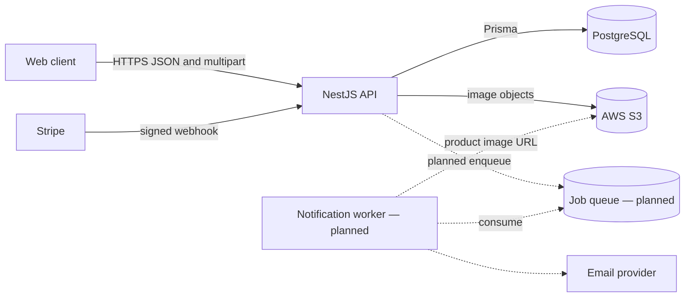

# T-Shirt Store API architecture

This document contains implementation context that does not belong beside every
consumer endpoint. The API surface and payloads are defined only by
[openapi.yaml](../api/openapi.yaml).

## Production shape

The NestJS API is stateless and can run as more than one instance. PostgreSQL is
the system of record. Images are stored in S3; only their URL/key and
relationships are stored in PostgreSQL. The required stock-notification worker
and its queue are the next implementation section.

## Domain boundaries

- Authentication owns users, access/refresh credentials, password-reset tokens,
  and password-change notifications.
- Catalog owns products, SKUs, image assets, SKU-image assignments, and likes.
- Cart owns the current client's mutable cart items.
- Orders own immutable item snapshots and the core status lifecycle.
- Payments owns Stripe Payment Links, Payment Intents, and webhook
  reconciliation.

Controllers apply CASL guards. Managers may manage products, SKUs, and images
and view all orders. Clients may read catalog data, set their own likes, manage
their own cart, create/view their own orders, and cancel their own unshipped
orders.

## Required implementation controls

- Build with NestJS/TypeScript, Prisma, and PostgreSQL; enforce Prettier and
  ESLint.
- Validate environment variables at startup.
- Use a global validation pipe configured to return the contract's 422 bodies,
  plus a global exception filter for `application/problem+json` errors.
- Enforce CASL abilities at controllers through guards and custom decorators.
- Configure Helmet and CORS. Rate-limit the forgotten/reset-password flow.
- Store static image files in AWS S3.
- Write service unit tests alongside implementation and end-to-end tests for
  authentication, checkout, and order history.

## Required flows

### Cart and Payment Intent

1. `POST /orders` snapshots the current cart into a `pending` order.
2. `POST /payment-intents` checks that the caller owns that pending order,
   validates current Product availability and SKU stock, calculates the stored
   order total, and creates the Stripe Payment Intent using the order id as the
   idempotency key and as intent metadata.
3. The client confirms payment using the returned client secret.
4. `payment_intent.succeeded` locks the affected Products and SKUs in a stable
   ID order and verifies that every order line is fully available. One database
   transaction then decrements every line in full, changes the order to `paid`,
   reconciles the cart, and records the event as processed. If any line is
   unavailable, none of these mutations is committed and the event remains
   unprocessed with its error. The stock-notification section extends this
   transaction with threshold-cycle evaluation.
5. Cart reconciliation subtracts each frozen order-line quantity from the
   current cart row for the same SKU. It updates a positive remainder, deletes
   the row when the remainder is zero or less, and does nothing if the row no
   longer exists. It therefore never removes more than the paid quantity.

Stripe documents that one Payment Intent normally maps to one cart/session, that
the server returns its client secret to the client, and that the order ID can be
stored as metadata:
[Payment Intents](https://docs.stripe.com/payments/payment-intents).

### Payment Link

`POST /payment-links` creates a Stripe-hosted URL for one SKU and fixed
quantity. Stripe Payment Links are reusable and create a Checkout Session for
each visit; completed sessions are reported through
`checkout.session.completed`:
[Payment Links](https://docs.stripe.com/api/payment-link),
[tracking a Payment Link](https://docs.stripe.com/payment-links/url-parameters).

A purchaser using a shareable URL is mapped to a Client by the email on the
completed Stripe session, because `orders.client_id` is NOT NULL and there is no
guest checkout. An email that matches no user leaves the event stored and
unprocessed instead of creating an order. The completed-session webhook creates
the order and applies the successful-payment transition to `paid` in one
transaction, and updates stock; link creation itself never returns data that
does not exist yet.

### Webhooks and stock notifications

`POST /webhooks/stripe` verifies the `Stripe-Signature` header against the raw
request body and stores/recognizes the Stripe event ID before applying changes.
The same event ID must not update an order or stock twice. Stripe's webhook
guidance requires signature verification against the raw body:
[Stripe webhooks](https://docs.stripe.com/webhooks).

The webhook returns 204 after durable receipt, including when business
processing cannot yet finish. The queue section adds a scheduled reconciliation
producer that scans `stripe_webhook_events WHERE processed_at IS NULL` in
oldest-first batches and enqueues their IDs. Workers claim rows with
`FOR UPDATE SKIP LOCKED` and rerun the same idempotent handler; success sets
`processed_at`, while another failure keeps the row pending with its latest
error. Therefore recovery does not depend on Stripe redelivering an event
already acknowledged by the API.

Every stock mutation locks the Product row before its SKUs so concurrent
changes for the same Product cannot calculate different aggregate totals. The
service compares the sum of all SKU stock immediately before and after the
mutation. A low-stock event occurs only on a downward crossing from `> 3` to
`<= 3`, including a jump such as 5 to 2, and enqueues one email job. Remaining
at or below 3 does not enqueue another job. An upward crossing from `<= 3` to
`> 3` increments `products.low_stock_cycle`; remaining above 3 does not. The
worker sends the notification, including a product image, to clients who liked
the product and have no order line for any of its SKUs in an order that is paid
and not cancelled. `uq_stock_notice_cycle` allows one email per client,
product, and cycle, so a client is warned once per low-stock event rather than
once in the product's lifetime.

## Queue choice

A queue is required by the assignment and keeps email-provider latency and
retries outside product/SKU/payment requests. The API transaction records the
state change and enqueues the smallest stable job identifier; the worker reloads
current recipient/image data and records the send outcome. The exact queue
product is an implementation choice, not part of the HTTP contract.

## Monitoring

Monitor API latency/error rate, PostgreSQL connection/lock pressure, failed or
old queue jobs, email failures, S3 upload errors, Stripe signature failures,
unprocessed webhook events, duplicate webhook deliveries, payment/order
reconciliation mismatches, and any attempt to reduce stock below zero.

## Explicit non-scope

Optional delivery-person and promo-code features are not selected. There are no
manager dashboard/reporting routes, category discovery route, image
delete/reorder/reassignment routes, liked-products listing, product hard delete,
or separate unlike operation.
